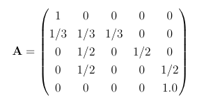

# Simulating the hitting probabilities

Consder the Markov chain that is illustrated in the transition graph shown below:

States 2, 3 and 4 in this chain are transient and states 1 and 5 are absorbing.  If the chain is run for long enough the system is guaranteed to end up in state 1 or state 5.  If we simulate this chain until absorption we can thus define a Bernoulli random variable and state that this random variable is 1 if the chain finishes in state 5 and is zero if the chain finishes in state 1.  Your task in this exercise is to write a function to estimate the p parameter of this Bernoulli random variable by sampling.

I would recommend that you start by noting that the transition matrix that corresponds to the chain above is:

You can thus set a variable `A` equal to this matrix by using the `np.array` command that was introduced in previous exercises.

To sample the chain you should write a function called `markov_move` that is similar to the function that you wrote for generating the next state in a Markov chain.  Just as in the previous exercises this function takes two arguments.  The first of these arguments, `trans`, should be the 1-step transition matrix for the Markov chain that is being simulated.  The second argument, `start`, is the state that the system is currently within.  Your function should generate the next state in the chain.

Next you should write a function called `endstate`.  This function should take two arguments.  The first of these arguments, `trans`, should be the 1-step transition matrix for the Markov chain that is being simulated.  The second argument `start` is then state that the system starts within. Within your `endstate` function you should use a while loop to call `markov_move` until you have arrived in one of the absorbing states.  Once you arrive in one of the absorbing states the function should return a 1 if you have finished in state 5 and a 0 if you have finished in state 1.

The final function you should write should be called `sample_mean`.   This function should take three arguments.  The first of these arguments, `trans`, should be the 1-step transition matrix for the Markov chain that is being simulated.  The second argument `start` is then state that the system starts within.  The final argument `nsamples` should be the number of samples that are going to be generated by calling `endstate`.  This final function should call `endstate` `nsamples` times and thus generate `nsamples` samples of the Bernoulli random variable of interest.  You should calculate a sample mean and a sample variance from these `nsamples` copies of the random variable.  The function `sample_mean` should then return 2 arguments:

* `mean` - the sample mean that was obtained by calling `endstate` `nsamples` times
* `conf` - the 90% confidence limit around this estimate of the mean

You can calculate the confidence limit by using the ideas about the central limit theorem that were introduced in previous exercises.
